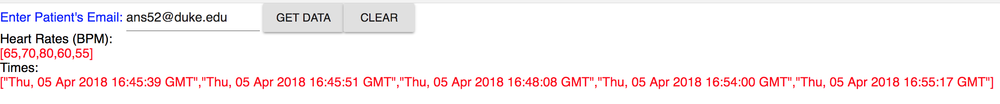

# hr_monitor_doctor_client
## About this software
The program titled "hrm-client" provides an easy-to-use interface to "heart_rate_databases_introduction". When the program is running, the user simply needs to type the patient's email address into the search bar and click "GET DATA" to receive a list of all the recorded heart rates for that patient, as well as a list of the times at which those heart rates were recorded. Clicking "CLEAR" will then clear both the input and outputs so that the user can query the database for a different patient. A sample output can be seen below.

## Basic Set-Up Instructions
### (Optional) Set up New Database and Run Script
First, log into your VCM then spin up the database using the command "sudo mongod." After the database is running, start the flask applcation by running "gunicorn --bind 0.0.0.0:5000 main:app" in the folder containing your main script. If you wish to use this application for an extended period, open these in a screen. If you set up the database on a machine other than http://vcm-3607.vm.duke.edu, specify the machine in line 25 of the client program.

### Start Client Application
In a new terminal, run "npm run start" in the "hrm-client" folder. This will start up the application. Now simply type the patient's email and select "GET DATA" to generate a list of patient emails. 

### Notes
The server has recently been experiencing issues. You have to click "GET DATA" multiple times before the data is actually fetched. 
